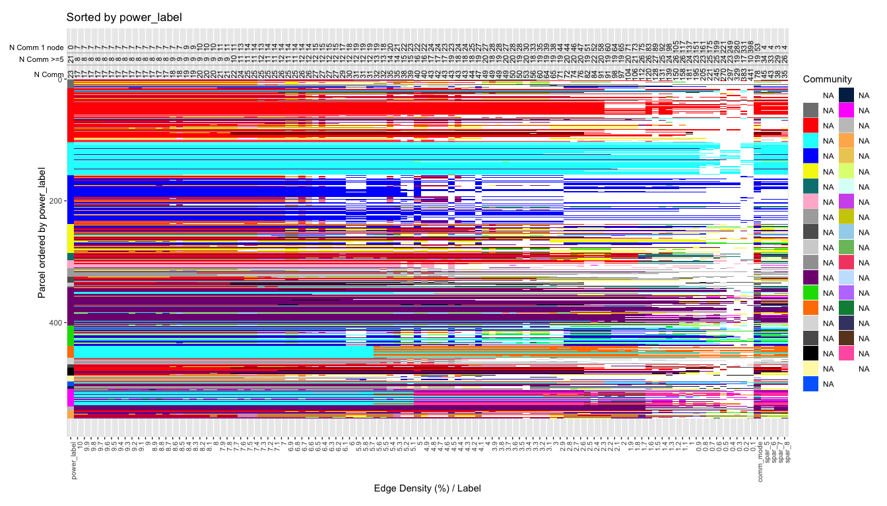
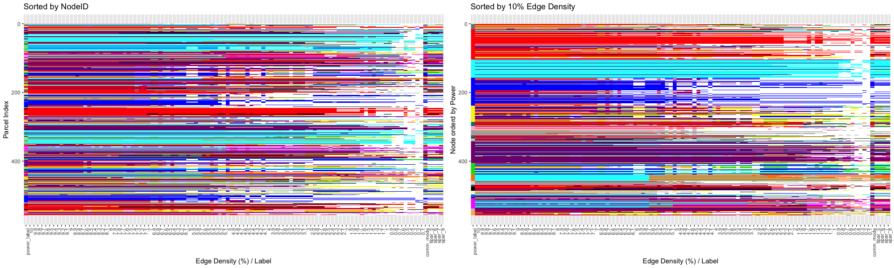
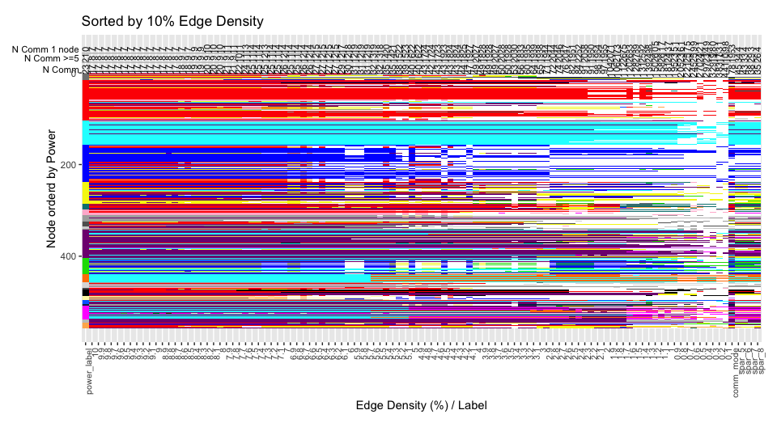
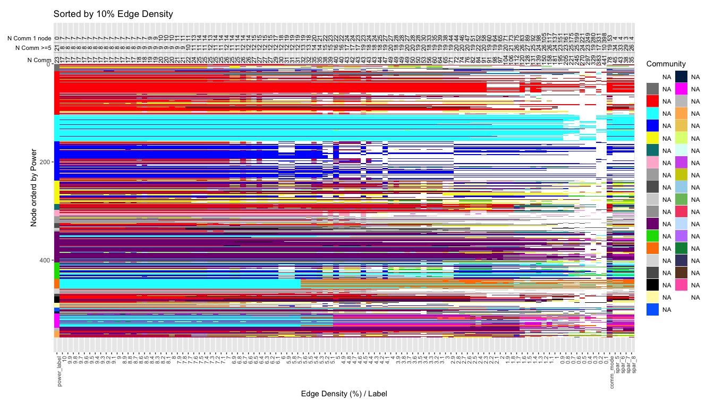

Making Community Assignment Plot with Multiple Density
================
9/04/2019

# Overview

This Rmd shows how the function that makes the community plot is setup
and gives an example of some tweaks that was made (and can be edited to
change the plot).

<!-- -->

# Read in subject community matrix & add NodeID column

  - This example has 100 columns of assignments, ordered from 0.1% to
    10% edge density

<!-- end list -->

``` r
c <- read.csv('./sample_sub_sorted_community_mode.txt', header=F)
csum <- read.table("./parcel_community.txt", header=T, sep="\t")

csum[csum==0] <- 1

# Rename Column name as Edge Density
colnames(c)[1:ncol(c)] <- seq(.1,10,.1) #  .1% to 10%

# Add NodeID column to matrix
c <- cbind(csum, c)
```

Show 9-10%

``` r
head(c[as.character(seq(9.1,10,.1))])
```

    ##   9.1 9.2 9.3 9.4 9.5 9.6 9.7 9.8 9.9 10
    ## 1   3   3   3   3   3   3   3   3   3  3
    ## 2   4   4   4   4   4   4   4   4   4  4
    ## 3   4   4   4   4   4   4   4   4   4  4
    ## 4   3   3   3   3   3   3   3   3   3  3
    ## 5   5   5   5   5   5   5   5   5   5  5
    ## 6   6   6   6   6   6   6   6   6   6  6

## Sort the commnuity matrix

  - Adding a sorting column. Can be Power or the highest density (or
    whatever vector order you choose).
  - This example uses Power

<!-- end list -->

``` r
#### Edit to change reference order ####
# 10% edge density, can be replaced by Power/others
sorting_order <- order(c$power_label) 
##################################

sc <- c[sorting_order,]
sc$ReorderRef <- order(sc$power_label) # extract order of reordered reference and save it as a column
```

Sorted community matrix 9-10%

``` r
head(sc[as.character(seq(9.1,10,.1))])
```

    ##     9.1 9.2 9.3 9.4 9.5 9.6 9.7 9.8 9.9 10
    ## 185  14  14  14  14  14  14  14  14  14 14
    ## 197   3   3   3   3   3   3   3   3   3  3
    ## 199   3   3   3   3   3   3   3   3   3  3
    ## 213  10  10  10  10  10  10  10  10  10 10
    ## 214   6   6   6   6   6   6   6   6   6  6
    ## 216   3   3   3   3   3   3   3   3   3  3

## Wide (matrix) to long data format (plotting purposes)

``` r
# wide to long format
scc <- sc %>%
  gather("td", "CommID", -par_id, -par_vertex, -ReorderRef)

scc$td <- factor(scc$td, levels = c(rev(names(csum)[4:ncol(csum)-1]),
                                    as.character(seq(.1,10,.1)),
                                    'power_label')) # Order the Edge Density factor levels
```

## Make a new column of reassigned community labels

  - Here the reassignment was done by assigning anything above `41` as
    `1`.
  - Other type of reassignemnts can be done where communities fewer than
    N nodes are assigned to `1`

<!-- end list -->

``` r
scc$CommID_reassigned <- scc$CommID 
scc$CommID_reassigned[scc$CommID>41] <- 1 # unassigned
scc$CommID_reassigned <- factor(scc$CommID_reassigned)
```

Long format data frame with reassigned labels

``` r
head(scc)
```

    ##   par_id par_vertex ReorderRef        td CommID CommID_reassigned
    ## 1    185      19856          1 comm_mode    125                 1
    ## 2    197      21193          2 comm_mode    104                 1
    ## 3    199      21451          3 comm_mode      3                 3
    ## 4    213      21987          4 comm_mode     91                 1
    ## 5    214      22004          5 comm_mode     15                15
    ## 6    216      22089          6 comm_mode     73                 1

## Setup the Color Palette

  - This uses a systemlabel.txt file that already has information of how
    each community should be colored.

<!-- end list -->

``` r
syslabel <- read.csv("./systemlabel.txt")
head(syslabel)
```

    ##   CommID   R   G   B     hex                       LabelName
    ## 1      1 255 255 255 #ffffff                   u1_Unassigned
    ## 2      2 128 128 128 #808080     u2_Ventral_frontal_temporal
    ## 3      3 255   0   0 #ff0000                 a3_Default_mode
    ## 4      4   0 255 255 #00ffff     a4_Hand_somatosensory-motor
    ## 5      5   0   0 255 #0000ff                       a5_Visual
    ## 6      6 245 245  15 #f5f50f a6_Fronto-parietal_task_control

  - A color palette `syscolor` is created to be feed into ggplot.
      - Note that the color for communities that don’t exist in this
        subject is filtered out.

<!-- end list -->

``` r
# Make color excluding those not in this subject
comm_in_sub <- is.element(syslabel$CommID, scc$CommID_reassigned)
syscolor <- as.character(syslabel$hex[comm_in_sub])
names(syscolor) <- as.character(syslabel$CommID[comm_in_sub])

head(syscolor)
```

    ##         1         2         3         4         5         6 
    ## "#ffffff" "#808080" "#ff0000" "#00ffff" "#0000ff" "#f5f50f"

## Basic Community plot sorted by Parcel ID or an Atlas (Power et al. 2011)

  - Used `scale_x_discrete(limits=rev(levels(scc$td)))` to flip x axis
    to have higher density on the left

<!-- end list -->

``` r
g1 <- scc %>%
  ggplot(aes(x = td, y = par_id)) +
  geom_raster(aes(fill=CommID_reassigned)) +
  scale_y_reverse() +
  scale_x_discrete(limits=rev(levels(scc$td))) +
  xlab("Edge Density (%) / Label") +
  ylab("Parcel Index") +
  scale_fill_manual(values = syscolor) +
  ggtitle("Sorted by NodeID") +
  theme(legend.position = "none",
        axis.text.x = element_text(angle = 90, hjust = 1, size=8))

g2 <- scc %>%
  ggplot(aes(x = td, y = ReorderRef)) +
  geom_raster(aes(fill=CommID_reassigned)) +
  scale_y_reverse() +
  scale_x_discrete(limits=rev(levels(scc$td))) +
  xlab("Edge Density (%) / Label") +
  ylab("Node orderd by Power") +
  scale_fill_manual(values = syscolor) +
  ggtitle("Sorted by 10% Edge Density") +
  theme(legend.position = "none",
        axis.text.x = element_text(angle = 90, hjust = 1, size=8))

grid.arrange(g1, g2, ncol=2)
```

<!-- -->

## Add number of unique communities on top

  - 1.  Count N community is at each density (before any reassignment)

  - 2.  Count N community with 5 or more nodes

  - 3.  Count N singletons (community with only 1 node)

  - Position all of these above above the original plot using
    `geom_text()`

<!-- end list -->

``` r
u_comm <- scc %>%
  group_by(td) %>%
  summarise(count=n_distinct(CommID))
u_comm$y <- -8 

u_comm_5p <- data.frame(td=levels(scc$td), 
                                 y=-33,
                                 count=sapply(X = levels(scc$td),
                                              FUN = function(x){sum(table(scc$CommID[scc$td==x]) >= 5)}))

u_comm_1 <- data.frame(td=levels(scc$td),
                             y=-53, 
                             count=sapply(X = levels(scc$td),
                                          FUN = function(x){sum(table(scc$CommID[scc$td==x]) == 1)}))

clabel <- data.frame(y=c(-8,-33,-53), 
                     td=11, 
                     label=c("N Comm","N Comm >=5","N Comm 1 node"))

g2 <- g2 + 
  # add community count info on top
  geom_text(data=u_comm, aes(x=td, y=y, label=count), angle = 90, size=3) +
  geom_text(data=u_comm_5p, aes(x=td, y=y, label=count), angle = 90, size=3) +
  geom_text(data=u_comm_1, aes(x=td, y=y, label=count), angle = 90, size=3) +
  geom_hline(yintercept = c(-23,-43), color="grey") + 
  geom_text(data=clabel, aes(y=y, label=label), x=0,
            hjust = 1,
            size = 3) +  
  coord_cartesian(# xlim = c(0.1, 10), # This focuses the x-axis on the range of interest
                  clip = 'off') +   # This keeps the labels from disappearing
  theme(legend.position = "none",
        axis.text.x = element_text(angle = 90, hjust = 1, size=8),
        plot.margin = unit(c(1,1,1,3), "lines")) # This widens the left margin

print(g2)
```

<!-- -->

## Show color legend

  - Add short-name of label to make legend for color

<!-- end list -->

``` r
g2 <- suppressMessages(g2 + scale_fill_manual(values = syscolor, 
                    name = "Community",
                    labels = as.character(syslabel$ShortName[comm_in_sub])) +
  theme(legend.position = "right"))

print(g2)
```

<!-- -->
